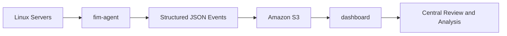
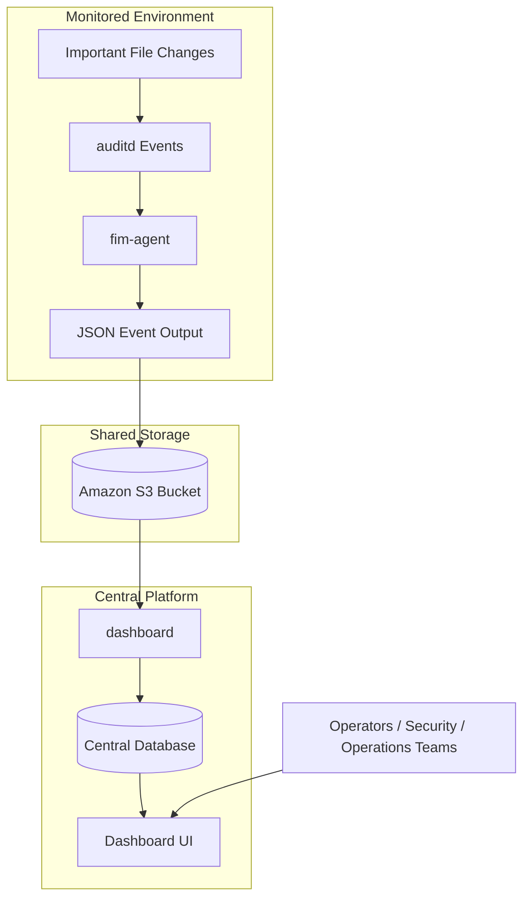
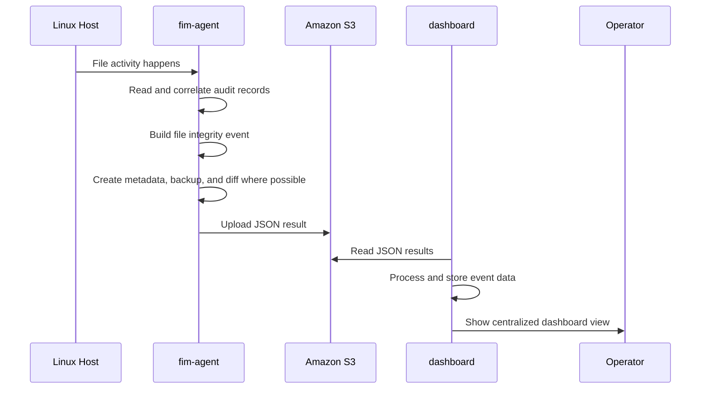
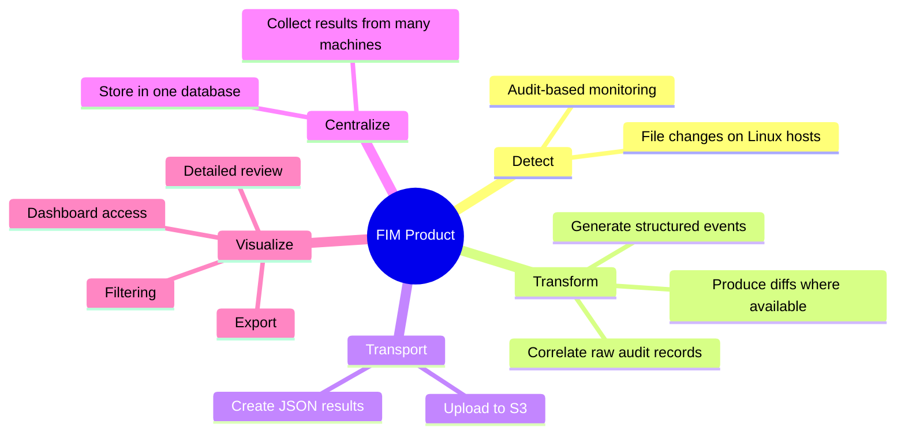
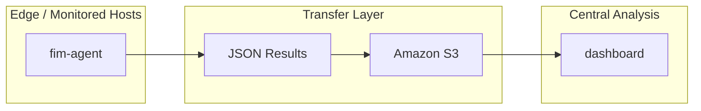
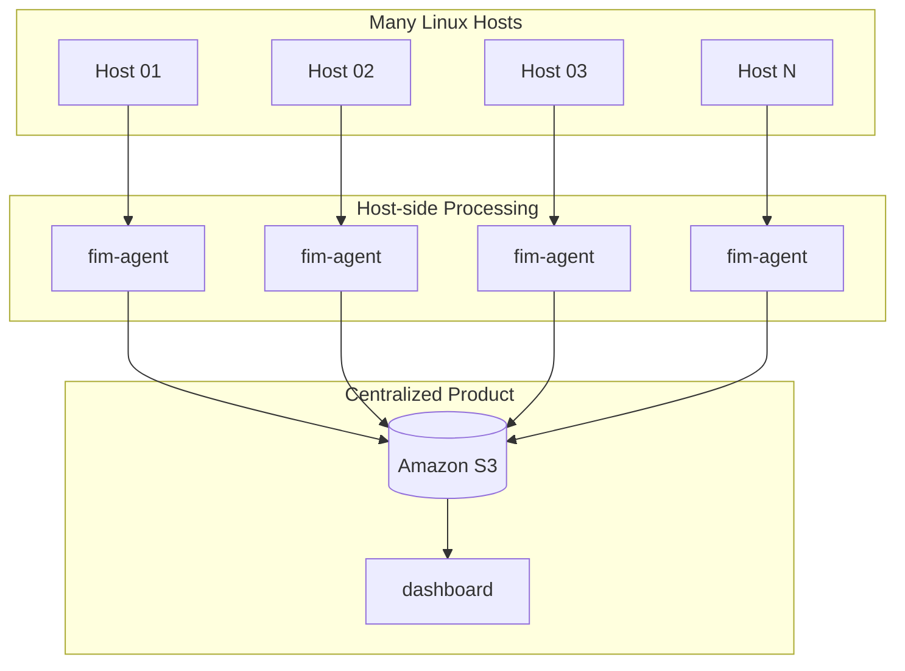

# File Integrity Monitor (FIM)

>**Note**: This is an **open-source project** developed by the WSO2 Infra team to improve operational efficiency, support auditing and evidence generation, and assist with server troubleshooting. Please note that this is an **ongoing development project**, and improved versions will be released in the future. This implementation represents the outcome of our current research efforts.

FIM provides a complete workflow for detecting, collecting, and reviewing file changes across Linux environments. The product combines two main components: **FIM Agent** and **FIM Dashboard**.

The **FIM Agent** runs on monitored hosts and uses Linux `auditd` logs to detect file changes, reconstruct meaningful events, and generate structured JSON records with relevant metadata and file difference details where applicable. The **FIM Dashboard** collects those results from Amazon S3, stores them in a central MySQL database, and presents them through a web interface for analysis, filtering, and review.

Together, these components turn low-level file activity into centralized, understandable, and actionable file integrity monitoring data.

---

## Overview

The File Integrity Monitor product works as a complete pipeline from **host-level file change detection** to **centralized review and analysis**.

At a high level:

* The **fim-agent** runs on monitored Linux machines
* It reads file-related audit activity and converts it into structured event records
* Those records are stored as JSON files and uploaded to Amazon S3
* The **dashboard** reads those JSON files from S3
* It stores the extracted event data in a database
* It provides a web interface for reviewing, filtering, and analyzing all collected results centrally

This means the product is not only for detecting file changes, but also for making those changes easy to understand and investigate at scale.

---

## High-Level Architecture



---

## End-to-End Product Flow



---

## How the Product Works

The product has two main parts: **fim-agent** and **dashboard**.

### fim-agent

The **fim-agent** runs on monitored Linux hosts and watches file-related system activity using Linux audit logs.

Its role is to:

* detect relevant file changes
* correlate raw audit records into meaningful events
* identify the affected file and execution context
* preserve useful evidence such as metadata and diffs
* generate structured JSON output
* upload the generated results for centralized processing

In simple terms, the agent transforms low-level system audit activity into understandable file integrity records.

### dashboard

The **dashboard** is the centralized product layer used to collect and review all FIM results.

Its role is to:

* read JSON result files from Amazon S3
* process and store them in a central database
* provide a web-based view of collected file integrity events
* support filtering, review, and export for operational use

In simple terms, the dashboard turns distributed JSON result files into a centralized monitoring and analysis experience.

---

## Combined Product Logic



---

## Why This Product Exists

Reviewing raw audit logs directly is difficult, especially when monitoring multiple machines.

The File Integrity Monitor product solves that problem by turning fragmented system-level records into a centralized and readable monitoring flow.

Instead of manually checking raw logs across many servers, teams can use this product to:

* detect important file changes
* preserve change evidence
* centralize records from many hosts
* investigate changes through a dashboard
* support troubleshooting, operational audits, and forensic review

This makes the product useful both for day-to-day operations and for security-focused investigations.

---

## Core Product Capabilities



---

## Product Value

The File Integrity Monitor product provides value in three main areas:

### Detection

It identifies when monitored files are changed on Linux systems.

### Evidence

It keeps structured records about what happened, including context and change details where available.

### Centralized Visibility

It provides a single place to review results from multiple machines instead of checking systems one by one.

---

## Product Components Relationship



---

## Operational View



---

## Simple Explanation

You can think of the product like this:

* **fim-agent** is the part that runs on each server and prepares file change results
* **dashboard** is the part that collects all results and shows them in one place

So the overall product flow is:

```text
File change on server -> fim-agent -> JSON result -> S3 -> dashboard -> central review
```

---

## Main Use Cases

The File Integrity Monitor product is useful for:

* monitoring important file changes on Linux systems
* operational auditing
* evidence generation
* investigating unexpected modifications
* centralized visibility across multiple machines
* reviewing file diffs and related context
* exporting collected results for further analysis

---

## Product Summary

The **File Integrity Monitor (FIM)** product combines **fim-agent** and **dashboard** into one complete monitoring solution.

* **fim-agent** detects and prepares file integrity events on monitored hosts
* **dashboard** centralizes, stores, and presents those events for analysis

Together, they provide a full pipeline from **file change detection** to **centralized review**.

---

## Repository View

```text
file-integrity-monitor/
├── fim-agent/
├── dashboard/
└── README.md
```

---

## Detailed Documentation

For component-level setup and implementation details, refer to:

* `fim-agent/README.md`
* `dashboard/README.md`
