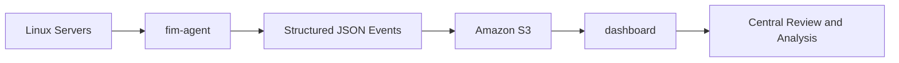
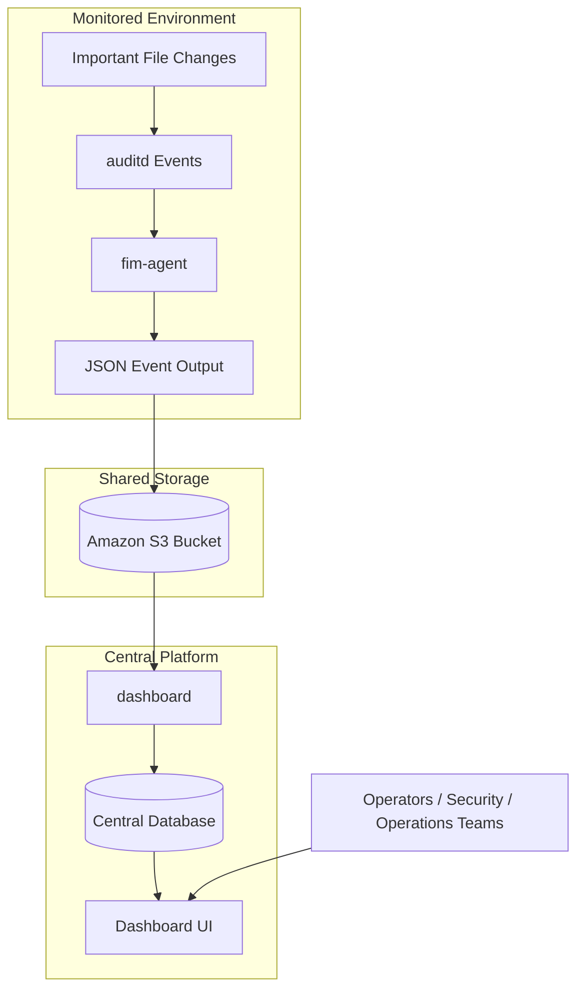
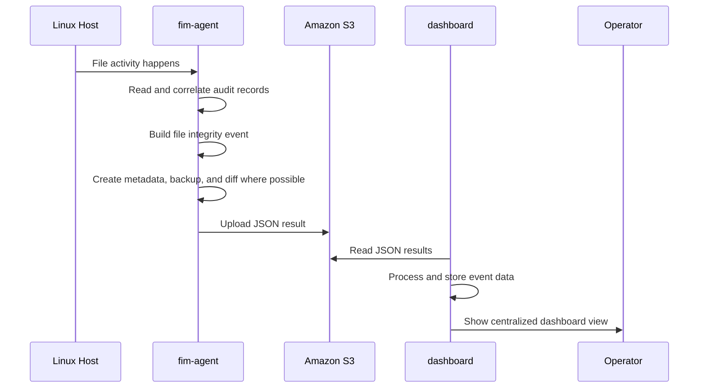
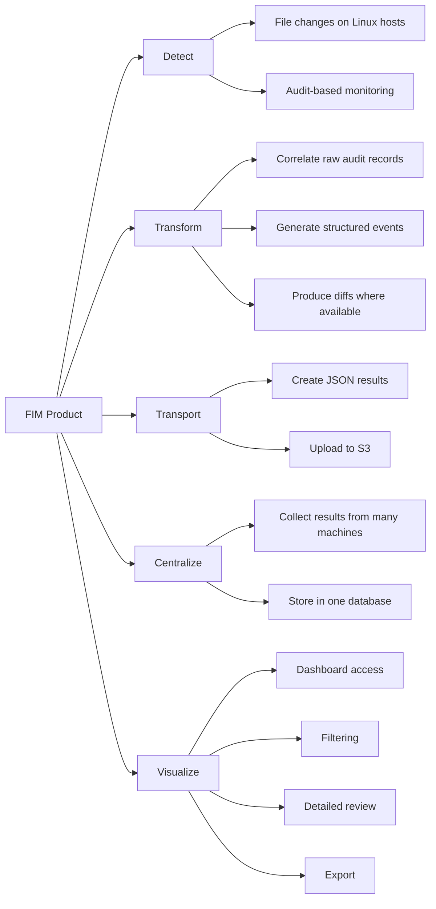
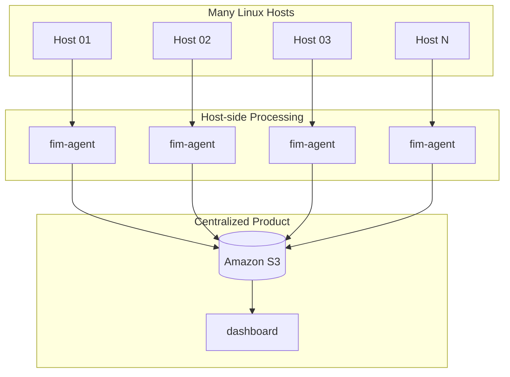

# File Integrity Monitor (FIM)
---

> **Note**: This is an **open-source project** developed by the WSO2 Infra team to improve operational efficiency, support auditing and evidence generation, and assist with server troubleshooting. This is an **ongoing development project**, and improved versions will be released in future iterations. This implementation represents the current outcome of our research efforts.

---

## Introduction

As part of a research initiative, we developed **File Integrity Monitor (FIM)** for Linux distributions using **Audit Daemon (`auditd`) logs**. The solution is designed to detect, collect, and review changes made to important system files and configurations. While the current implementation focuses on Linux environments, the overall approach can be extended to other operating systems that support AuditD-style auditing.

The main objective of FIM is to identify unauthorized or unexpected file system changes and convert low-level audit activity into meaningful, reviewable integrity records. This helps strengthen security operations by highlighting potential breaches, malware activity, insider threats, misconfigurations, and unauthorized administrative actions.

> **A key strength of this solution is its ability to accurately trace the originating user even when file system modifications are performed through elevated or switched root privileges.**

This gives teams clearer accountability and visibility during investigations, which can be difficult to achieve with some existing commercial products. At the same time, the solution provides a practical and cost-effective approach for organizations that need strong monitoring, auditing, and compliance support.

FIM provides a complete end-to-end workflow through two main components:

- **FIM Agent** – runs on monitored hosts, reads `auditd` logs, reconstructs meaningful file-change events, and produces structured JSON results with metadata and diff details where applicable
- **FIM Dashboard** – collects those JSON results from Amazon S3, stores them in a central MySQL database, and presents them through a web interface for review, filtering, and analysis

Together, these components turn fragmented low-level file activity into centralized, understandable, and actionable file integrity monitoring data.

## Key Features

- **Unauthorized File Modification Detection**  
  Identifies changes to critical system files such as `/etc/*` to help maintain configuration and log integrity.

- **Privileged Activity Monitoring**  
  Tracks privileged actions to improve visibility into administrative activity and strengthen OS hardening.

- **OS Patch Monitoring**  
  Detects unexpected or unauthorized system update activity that may indicate misuse or compromise.

- **Permission Change Detection**  
  Identifies file and directory permission changes to help resolve security misconfigurations and access-related issues.

- **Command Execution Monitoring**  
  Captures executed commands associated with monitored directories and file-change events.

- **File Creation and Deletion Detection**  
  Detects unauthorized file creation and deletion events in monitored locations.

- **Centralized Audit Data Storage**  
  Supports agent-based deployment with centralized collection and dashboard-based review.

- **Resource Usage Control**  
  Enforces resource limits for the FIM service to help protect overall OS health and stability.

---

## Overview

The File Integrity Monitor product works as a complete pipeline from **host-level file change detection** to **centralized review and analysis**.

At a high level:

* The **fim-agent** runs on monitored Linux machines
* It reads file-related audit activity and converts it into structured event records
* Those records are stored as JSON files and uploaded to Amazon S3
* The **dashboard** reads those JSON files from S3
* It stores the extracted event data in a database
* It provides a web interface for reviewing, filtering, and analyzing all collected results centrally

This means the product is not only for detecting file changes, but also for making those changes easy to understand and investigate at scale.

---

## High-Level Architecture



---

## End-to-End Product Flow



---

## How the Product Works

The File Integrity Monitor product is built around two main components: **fim-agent** and **dashboard**.

### fim-agent

The **fim-agent** runs on monitored Linux hosts and uses Linux `auditd` logs to identify important file-related activity.

Its main responsibilities are to:

- Detect relevant file changes
- Correlate raw audit records into meaningful file events
- Identify the affected file, execution context, and responsible user or process
- Preserve useful evidence such as metadata, backups, and diffs where applicable
- Generate structured JSON event files
- Upload the generated results for centralized processing

In simple terms, the **fim-agent** converts low-level audit activity on each monitored server into understandable file integrity records.

### dashboard

The **dashboard** is the centralized component used to collect, store, and review FIM results.

Its main responsibilities are to:

- Read JSON result files from Amazon S3
- Process and store extracted event data in a central database
- Provide a web-based interface for reviewing collected FIM results
- Support filtering, investigation, and export for operational use

In simple terms, the **dashboard** turns distributed JSON event files into a centralized monitoring and analysis platform.

### FIM Setup Configuration

To set up the full FIM product, the first step is to create an **Amazon S3 bucket**. This bucket acts as the connection point between the **fim-agent** and the **dashboard**, because agents upload generated JSON event files to S3 and the dashboard later collects those files for centralized processing.

After preparing the S3 bucket, identify the Linux servers that need to be monitored and install the **fim-agent** on those servers by following the instructions in the `fim-agent` README.

Next, select a centralized server that will host the **dashboard** component. Then, using the documentation in the `dashboard` folder, install and configure the dashboard on that centralized server.

In summary, the setup flow is:

1. Create the Amazon S3 bucket
2. Configure the required AWS details
3. Install **fim-agent** on all monitoring servers
4. Choose a centralized server for the **dashboard**
5. Install and configure the **dashboard**
6. Verify the end-to-end flow from monitored hosts to centralized review

---

## Combined Product Logic



---

## Why This Product Exists

Reviewing raw audit logs directly is difficult, especially when monitoring multiple machines.

The File Integrity Monitor product solves that problem by turning fragmented system-level records into a centralized and readable monitoring flow.

Instead of manually checking raw logs across many servers, teams can use this product to:

* Detect important file changes
* Preserve change evidence
* Centralize records from many hosts
* Investigate changes through a dashboard
* Support troubleshooting, operational audits, and forensic review

This makes the product useful both for day-to-day operations and for security-focused investigations.

---

## Core Product Capabilities



---

## Operational View



---

## Main Use Cases

The File Integrity Monitor product is useful for:

* Monitoring important file changes on Linux systems
* Operational auditing
* Evidence generation
* Investigating unexpected modifications
* Centralized visibility across multiple machines
* Reviewing file diffs and related context
* Exporting collected results for further analysis

---

## Product Summary

The **File Integrity Monitor (FIM)** product combines **fim-agent** and **dashboard** into one complete monitoring solution.

* **fim-agent** detects and prepares file integrity events on monitored hosts
* **dashboard** centralizes, stores, and presents those events for analysis

Together, they provide a full pipeline from **file change detection** to **centralized review**.

---

## Repository View

```text
file-integrity-monitor/
├── fim-agent/
├── dashboard/
└── README.md
```

---

## Detailed Documentation

For component-level setup and implementation details, refer to:

* `fim-agent/README.md`
* `dashboard/README.md`
